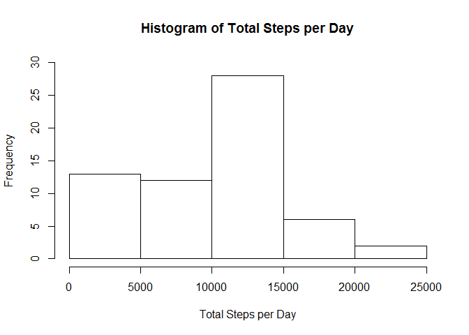
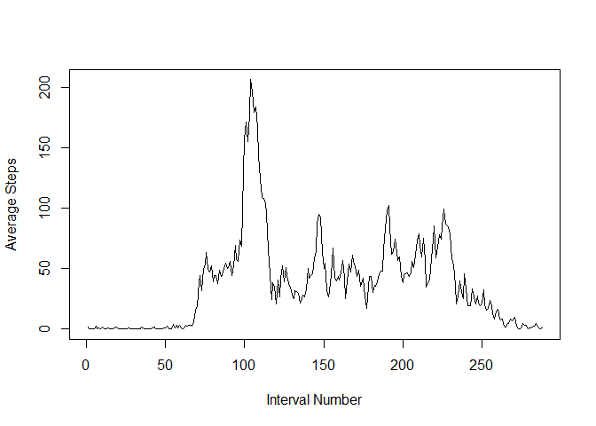
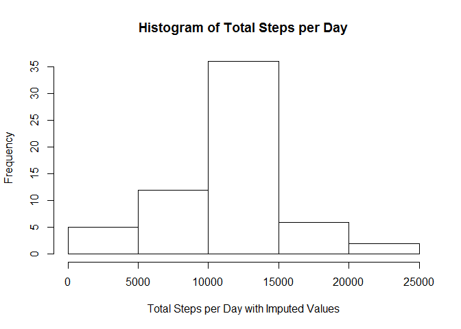
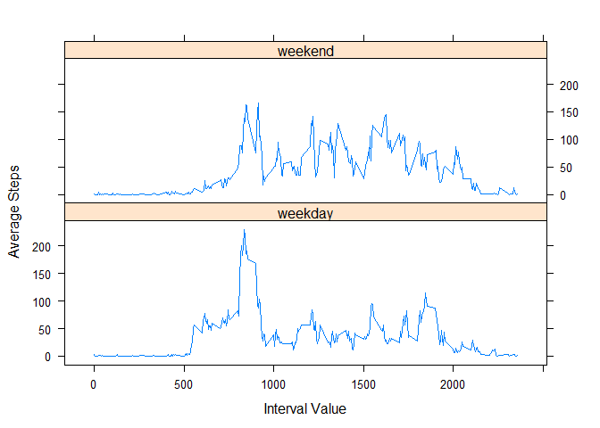

# Reproducible Research: Peer Assessment 1


## Loading and preprocessing the data

```r
actData <- read.csv("activity.csv")
```


## What is mean total number of steps taken per day?

```r
# create a histogram showing total number of steps taken each day
sumDays <- with(actData,tapply(steps,date,sum,na.rm=T))
hist(sumDays,xlab="Total Steps per Day",ylim=c(0,30),main="Histogram of Total Steps per Day")
```

 

```r
# calculate mean and median steps per day
meanDays <- format(mean(sumDays))
medianDays <-format(median(sumDays))
```
The mean of the total steps per day is 9354.23.  
The median of the total steps per day is 10395.


## What is the average daily activity pattern?

```r
# calculate the mean number of steps for each interval
# then plot the data as a time series
meanInt <- with(actData,tapply(steps,interval,mean,na.rm=T))
plot(meanInt,type="l",xlab="Interval Number",ylab="Average Steps")
```

 

```r
maxMean <- format(meanInt[which.max(meanInt)])
maxInt <- which.max(meanInt)
```
The 5-minute interval which has on average, across all days in the dataset, the maximum number of steps is 104.  
The average number of steps for that interval is 206.1698.  


## Imputing missing values

```r
# use the dplyr package
require(dplyr)
```

```
## Loading required package: dplyr
```

```
## Warning: package 'dplyr' was built under R version 3.2.2
```

```
## 
## Attaching package: 'dplyr'
## 
## The following objects are masked from 'package:stats':
## 
##     filter, lag
## 
## The following objects are masked from 'package:base':
## 
##     intersect, setdiff, setequal, union
```

```r
# count the number of records where steps=NA
missing <- sum(is.na(actData$steps))
# create a dataset which contains the mean number of steps for each interval
actData2 <- select(actData,steps,interval)
summint <- actData2%>%filter(!is.na(steps))%>%group_by(interval)%>%summarize(mean(steps))
# if the steps in an interval is NA, fill in its value with the mean for that interval
# first create a new copy of the original dataset
imputed <- actData
imputed$steps[is.na(imputed$steps)] <- summint[which(summint$interval==imputed$interval)]$`mean(steps)`
# create a histogram showing the data with imputed values
sumDays <- with(imputed,tapply(steps,date,sum,na.rm=T))
hist(sumDays,xlab="Total Steps per Day with Imputed Values",main="Histogram of Total Steps per Day")
```

 

```r
meanDays <- format(mean(sumDays))
medianDays <-format(median(sumDays))
```
The total number of missing values in the dataset is 2304.  
The mean of the total steps per day is 10766.19 and the median is 10766.19.  
These values differ from the mean and median values found earlier when missing values were not imputed.  
The impact of imputing values is an increase in the mean and median and a more even distribution of data 
resulting in the mean and median values being the same.  


## Are there differences in activity patterns between weekdays and weekends?

```r
# use the dplyr package
require(dplyr)
#create a new factor variable in the dataset with two levels "weekend" and "weekday"
copyimp <- imputed
copyimp <- mutate(copyimp,dayType=factor(1*(weekdays(as.Date(date)) %in% c("Saturday","Sunday")),labels=c("weekday","weekend")))
# calculate the mean number of steps for each interval, broken out by weekend or weekday
byday <- summarise(group_by(copyimp,dayType,interval),mean(steps))
# load the lattice package
library(lattice)
xyplot(`mean(steps)`~interval|dayType,byday,type="l",layout=c(1,2),xlab="Interval Value",ylab="Average Steps")
```

 
